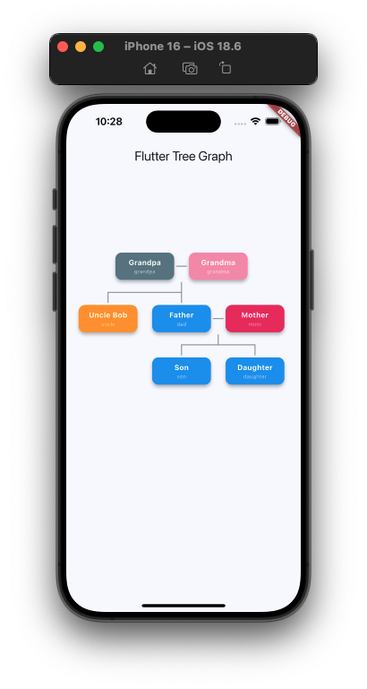

# flutter_tree_graph

A Flutter package for displaying hierarchical tree structures with automatic layout using Walker's algorithm (based on Buchheim's linear-time improvement).



## Features

-   **Automatic Layout**: Intelligently positions nodes to create compact, aesthetically pleasing trees.
-   **Multiple Algorithms**:
    -   **Walker's Layout**: Sophisticated layout that centers parents and aligns subtrees universally.
    -   **Simple Layout**: Basic hierarchical arrangement.
-   **Fully Customizable**:
    -   Build any widget for your nodes.
    -   Control node size, spacing, and line styles.
-   **Interactive**: Built-in support for panning and zooming.
-   **Partner Support**: Unique support for "partner" nodes (e.g., spouses in a family tree) that are kept adjacent.

## Installation

Add the package to your `pubspec.yaml`:

```yaml
dependencies:
  flutter_tree_graph: ^0.1.0
```

Or run:

```bash
flutter pub add flutter_tree_graph
```

## Usage

### 1. Define Your Data Model

Create a simple class that extends `TreeNodeData`. You only need to implement `id` and `parentIds`.

```dart
import 'package:flutter_tree_graph/flutter_tree_graph.dart';

class SimpleNode extends TreeNodeData {
  final String _id;
  final String _parentId;
  
  SimpleNode(this._id, [this._parentId = ""]);

  @override
  String get id => _id;

  @override
  List<String> get parentIds => _parentId.isNotEmpty ? [_parentId] : [];
}
```

### 2. Create Data

```dart
final List<SimpleNode> myData = [
  SimpleNode('Root'),
  SimpleNode('Child 1', 'Root'),
  SimpleNode('Child 2', 'Root'),
  SimpleNode('Grandchild', 'Child 1'),
];
```

### 3. Implement the Widget

```dart
TreeView<SimpleNode>(
  data: myData,
  nodeBuilder: (context, node) {
    return Card(
      child: Center(
        child: Text(node.id),
      ),
    );
  },
  layout: const WalkersTreeLayout(),
)
```

## Configuration

### TreeView Parameters

| Parameter | Type | Default | Description |
|-----------|------|---------|-------------|
| `data` | `List<T>` | **Required** | List of data items extending `TreeNodeData`. |
| `nodeBuilder` | `NodeBuilder<T>` | **Required** | Callback to build a widget for each node. |
| `layout` | `TreeLayout` | `SimpleLayout` | The positioning algorithm (e.g., `WalkersTreeLayout`). |
| `nodeWidth` | `double` | `100` | Width of each node in logical pixels. |
| `nodeHeight` | `double` | `80` | Height of each node in logical pixels. |
| `horizontalSpacing` | `double` | `50` | Horizontal gap between sibling nodes/subtrees. |
| `verticalSpacing` | `double` | `100` | Vertical gap between tree levels. |
| `lineColor` | `Color` | `Colors.grey` | Color of the connection lines. |
| `lineWidth` | `double` | `2.0` | Thickness of the connection lines. |

## Layout Algorithms

### SimpleLayout
A basic algorithm that places children below parents. Efficient but may result in wide trees for complex hierarchies.

### WalkersTreeLayout (Recommended)
An implementation of Walker's algorithm (Buchheim time-optimized). It produces standard, symmetrical tree drawings where:
- Parents are centered above children.
- Isomorphic subtrees look identical.
- The tree is as compact as possible.

## Roadmap

- \[x\] Basic tree layout
- \[x\] Simple grid algorithm
- \[x\] Walker's algorithm
- \[ \] Drag to reposition
- \[ \] Custom line styles
- \[ \] Animations

## Bugs and Requests

If you encounter any problems or have feature requests, please file an issue at the [issue tracker](https://github.com/NavaneethMv/flutter_tree_graph/issues).

## License

See [LICENSE](LICENSE) file.